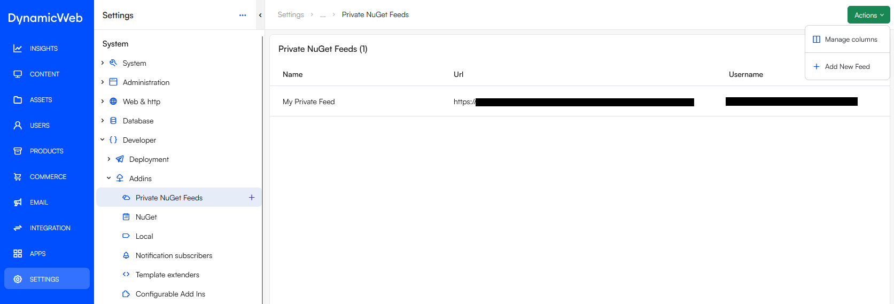

# Private NuGet Feeds
This plugin allows you to add private NuGet feeds to your project. It supports both authenticated and unauthenticated feeds, 
making it easy to manage dependencies from private sources.

## Requirements
- Dynamicweb 10.15.11 or later
- .NET 8.0 or later

## Features
- Add private NuGet feeds to your project via configuration or through the Dynamicweb admin interface.
- Support for authenticated and unauthenticated feeds.
- Integrates seamlessly with existing Apps in Dynamicweb.
- Easy to configure and manage.
- 
## Configuration Options
- `Name`: The name of the NuGet feed.
- `Url`: The URL of the NuGet feed.
- `Username`: (Optional) The username for authenticated feeds.
- `Password`: (Optional) The password for authenticated feeds.

## Installation
You can install the plugin via NuGet Package Manager or by adding the package reference through the 
Dynamicweb Apps interface.

One installed you will need to restart the application for the database to update and changes to take effect.

## Usage
To use this plugin, add the NuGet package `SJS.DW.PrivateNugetProvider` to your project.
You can then configure your private NuGet feeds in the configuration.

### Admin UI Configuration
You can add private NuGet feeds directly in the Dynamicweb admin interface under `Settings > System > Developer > AddIns > Private NuGet Feeds`.
[](./assets/ListView.png)

### Local Configuration
You can add private NuGet feeds directly in the `appsettings.{Environment}.json` file of your project. 
Additionally, you can add the configuration to your project secrets.

```json
{
  "PrivateNugetFeeds":
  [
    {
      "Name": "MyPrivateNugetFeed",
      "Url": "https://myPrivateNuget.feed/index.json",
      "Username": "MyUsername",
      "Password": "MySuperSecretPassword"
    }
  ]
}
```

### Cloud Configuration
While you can still use your appsettings.json file, it is recommended to use more secure methods when utilizing configurations.
This could include Azure Key Vault, AWS Secrets Manager, or any other secure storage solution that your cloud provider offers.

## License
This project is licensed under the MIT License - see the [MIT LICENSE](LICENSE) file for details